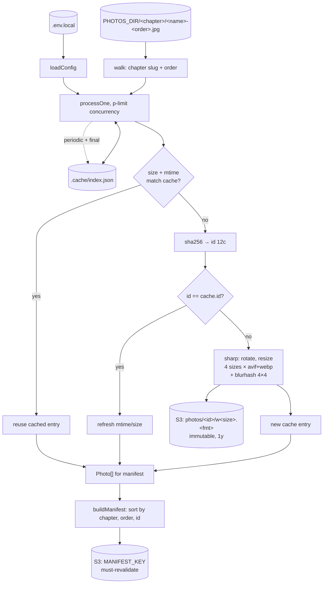

# @r2/photos

Sync local photos to S3 (one variant matrix per source) and publish a manifest the website reads at build time.

```bash
vp run @r2/photos#sync # full sync
vp run @r2/photos#sync --dry-run
vp run @r2/photos#sync --force <substring> --concurrency 8
```

## Flow

[](https://mermaid.live/edit#pako:eNpNU91O2zAUfhXLFwhEm5YkUBp-pgmYhiYGGmjSliLkJk5icOzIdmhL1ds9wG54IN5kTzIfu4HeJOfnO993zsnJEmcypzjBBZezrCLKoLvziUBIqyzdvvl6fXd9-3B--WOwxc2RzTeGqq3SHDlfkJqC0wdHqtyngsem3LkHDiqe0-3APgMuM8J9MCNZRW3YvQdM5HQePGopILsWRv3-KZoR_pTCI0FrXaR5W6Jd5JQ6AYfNijLlkuRnUhSs9DJF6VKNkhn4wPQeSOFBtb4WtIeaPmc1MyiTImuVoiJbfDSKjj9IIAiWoymINkvNXqhtqDaspsdTNTitickqX_lpBXiAWTxaUO3KnihtUkVbTT0qtzMY5QU7rJAOyvJUVyTcP0D__vy1HtoLM4ezJuS13f7S2icnnipgudeExKamooWiukrXb9_uAHq_34SvZc0cZFWTICUNMXZBtshi3XwxAlOjt1dEnlmxO6PTxiV20ZS3qiKWPn57jR2xmfuFt-Znun0bJaippJHanQ7L3RXNwAZKdzjgFLUB25Gyum4NmXLbw95iZ5PTLS0VdLb-St0SAQIrdiBSluB3Y2-EHLwLpBN8A42l96iQCtVEsIJqM8FrPgtxUJtIpy3j-dUakSAt7f8yXXQH2vOn2bNfyDVrK7oNXPkNXH3-fvnl4vbu4dvFL38wrTZ9RZ8JZ7ldth_SH1mAGqqYzFlmT6xggnAUwK3DwLiHS8VynBjV0h6uqaoJuHgJ9RNsKlrTCU6smdOCtNyOMxErW9YQ8VvKuqtUsi0rnBSEa-u1DTRxzkipSP0etb-EnepMtsLgJI5DR4KTJZ7jZH8YBfH4cDiK4ugwDuNxDy9wEo6CcTgOD8ajaBjvH0RhtOrhFyc7DEbDMBxG0eHQxsfjKFr9B3w0eZk)

<details>
<summary>mermaid source</summary>



</details>

## Conventions

**Source layout.** `PHOTOS_DIR/<chapter>/<anything>-<order>.jpg` (or `-<order>-<n>.jpg`). Chapter folder name is slugified; hidden dirs and non-jpeg files are skipped. Order is required, parsing fails loudly if missing.

**Identity.** `id = sha256(file).slice(0, 12)`. Content-addressed: same bytes always land at the same `photos/<id>/...` keys. The cache is keyed by relative path and entries for missing paths are pruned each run, so a rename re-uploads (idempotent on the bucket since the keys collide, but bytes are re-pushed).

**Cache invalidation.** Fast path compares `size + mtimeMs`. On mismatch the file is re-hashed; if the id is unchanged the stat is just refreshed. `--force <substring>` bypasses both checks for matching `relPath`s.

**Manifest URLs.** Built from `PUBLIC_BASE_URL` at write time, not stored in the cache, so the bucket can move without re-uploading anything.
